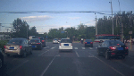
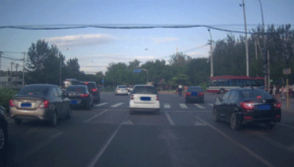
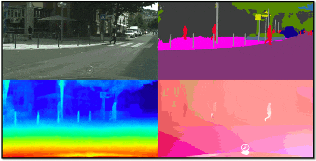
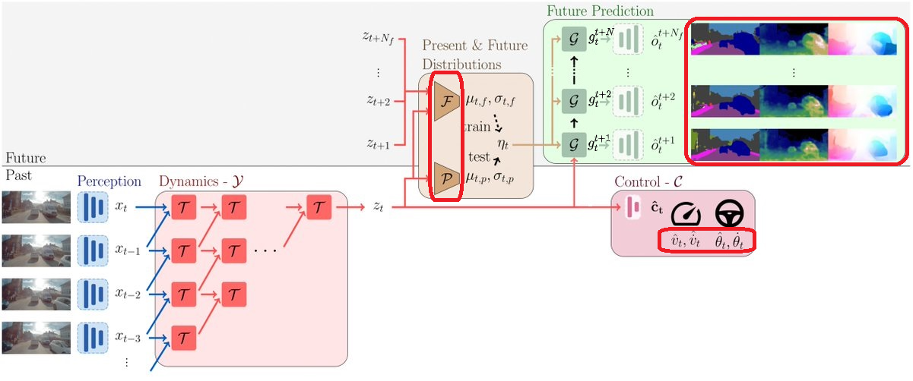
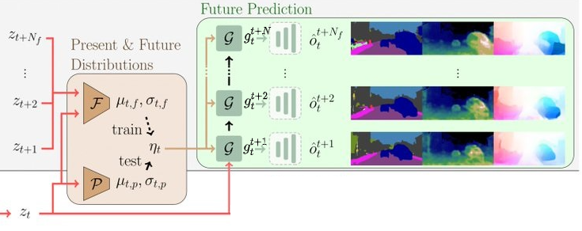
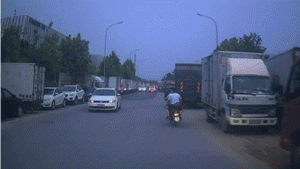
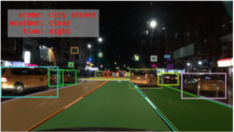

# Probabilistic Future Prediction for Video Scene Understanding
[This](#1) EECV 2020 paper proposes a novel deep learning (DL) method for autonomous driving. This method controls a car and predicts the future only from video data. What does future prediction have to do with autonomous driving? Well, a lot.
 
Being able to predict possible scenarios does indeed help while driving, right? Predicting the future is one of the greatest capabilities of humans. While driving it helps you decide when to slow down, accelerate, or break. At an intersection, you know that another car may come from the left, or someone may cross the street. The car and the pedestrian could also interact with each other (*Multi-Agent interaction*). What will happen is not completely certain: there is no **one future** but there are **many** possible **futures**. This is why the authors handle this problem not as deterministic, but as probabilistic.

You may ask "has this not be done already? Why is this paper different?". You see, the problem of future prediction is by far not as popular as image classification, but of course it has already been addressed.  But previous works had limitations.  
 * No end-to-end methods. This means that they did not carry out the whole process from the beginning - from the sequence of 2D data -  to the end - to the prediction and the car controls.  
 * Fail to model Multi-Agent interactions, by assuming for dynamics agents such as vehicles and pedestrians to act independently from each other.  
 * Work with low-resolution input or simulated and unrealistic data. As you can imagine, guessing what an image depicts it's not so easy if the image looks like the one on the left, instead of the one on the right. 
   
 On top of that, using video frames from simulated or unrealistic data does simplify the task. So, even if the evaluation is still indicative, it is controversial whether the model is capable of facing real-life situations. Reality is indeed much more challenging, unpredictable, diverse, and complicated than a game or a simulation.

## Input & Output
First, let’s reason about the method in terms of input and output. The input is a sequence of images, of 2D frames from videos. The predicted driving controls are velocity, acceleration, steering angle, and angular velocity. Then, how to show the predicted future? With a video, a sequence of  2D images as the input?  It may work. But we can do it smarter: let's predict semantic segmentation, depth, and optical flow. In other words,
 
  

 
* where is what. Where in the image do we have a car, a pedestrian, traffic light, sign, road, lane... This is *semantic segmentation* (upper right).
* How far from us is each object, hereby estimating its *depth* (lower left).
* from where to where each object did move with respect to the previous frame.  In other words,  estimate the movement or flow of certain particles in the image. This is called *optical flow* (lower right). 

But if you are not familiar with these three concepts, you can inform yourself  - there are many great blogs out there. But you can keep on reading this article just fine after this short introduction. If are not a Deep Learning (DL) scientist or are not craving for math, just skip the sections [Network](##Network) and [Losses](##Losses) and directly continue in [Results](##Results).

## Network
Let’s take a look at the data flow and see how the network is constructed. To allow a good grasp of the gradient flow, the red squares in the images show the variables involved in the loss computation.

The Perception module takes as input 5 frames of the past 1 second and encodes them into segmentation, flow, and depth information. That information is concatenated i.e. fused together for each input frame to produce the perception feature .  
Those features are fed to the Dynamics module, a 3D convolutional network that contains a novel module, the Temporal Block. This module extracts in parallel local and global features. On a local level, it separates the convolutions acquiring in parallel spatial features, vertical motion, horizontal motion, and overall motion. I will not dive deeper into it, since its analysis in the paper is pretty straightforward. The Dynamics module outputs the spatio-temporal representation , which contains information up to present time .  

This representation goes into the Prediction module. Here a generator, a convolutional GRU, takes as initial hidden state  and outputs future codes  for each future time step . The codes are then decoded to predict segmentation, depth, and flow maps for each one of the 10 future time steps, covering a total of 2 seconds.  
The spatio-temporal representation   goes also into the Control module. This module predicts the car controls -  velocity , acceleration , steering angle , and angular velocity - for each future time step.

At this point, the whole method does operate in a deterministic setting (the input to the generator for each time step is the zero vector).  How to make the method probabilistic? By adding the module containing the future and present distribution, the probabilistic module. More about it in the probabilistic loss section.

## Losses
Here the focus is on the exciting mathematical formulations. Yes, math. Math is powerful. If you are still reading, let’s go through the losses. The total loss is constructed by weighting and adding up three single losses:

 

### The prediction loss. 
First, where does the ground truth come from? From a teacher model. The encoders in the perception module are originally from two well-known autoencoder architectures ([[2]](#2) for segmentation and depth, PWC-Net[[3]](#3) for optical flow). Those autoencoders are pretrained jointly and then separated. While the encoders end up making part of the Perception module, the Decoders are used as a teacher module. The teacher takes the perception features of future frames and decodes them providing a pseudo ground-truth (note that these are other decoders as the ones in the prediction module).  
For each one of the future time steps , the predicted maps are compared to the output of a teacher model. For segmentation, via cross-entropy bootstrapping loss[[4]](#4) ,  for depth via scale-invariant depth loss[[5]](#5) ,  and for optical flow via the Huber loss . 

As you may have already seen if you are familiar with reinforcement learning, the loss for 3 timesteps in the future and the loss for 10 timesteps in the future do not have the same influence. The losses of each timestep  are not simply added together; before they are multiplied with a value , where  is the weighted discount term. Since ,  gets always smaller for increasing . In this way, the further we go into the future, the less does a loss count in the overall loss. Indeed, while driving the next half-second is more relevant than the future in 2 seconds, right?

 
 
### The control loss. 
Here the predicted controls are extrapolated and compared to the expert’s control actions  and .  The authors have access to these actions thanks to the company Wayve, the workplace of some of the paper authors. Exploiting expert's actions as ground truth is called *Conditional Imitation learning*. 

Each future timestep is weighted via the discount term gamma analogous to the prediction loss.

### The probabilistic loss. 
This is the most interesting loss, be ready for the exciting math. This loss is built according to the conditional variational approach. (I aim for a clear, short, and concise idea of conditional variational approaches, without the intention of completeness. It is closely related to Bayesian inference and variational autoencoders, about which there are whole books and articles.). Let’s see how this approach works.
 
Suppose we are interested in a certain probability distribution. For example the probability distribution  of the future random variable *Z* given certain observations *x*. We do not know the distribution *p* but we have access to a part of the data generated by this distribution (our dataset). In this case, we can approximate *p* with a variational distribution  of a latent variable *z*, parametrized by parameters . We just need to regress the parameters  with a neural network and force the two distributions *p* and *q* to be similar via KL divergence.
 
 

Easy, right?

On this line of thoughts, the authors define two distributions:
 * **Present distribution**  parametrized by network *P*, which takes as input the spatio-temporal representation . This distribution predicts the future given observations up to the present time *t*. It represents what COULD happen given the past observations.
 * **Future distribution**  parametrized by network *F*, which takes as input the spatio-temporal representation . It is conditioned on , so it is aware of both past and future information. It represents what DOES actually HAPPEN in that precise observation or video sequence. 
  

Both distributions are 8-dimensional, diagonal Gaussian distributions. Here,  8  uncorrelated dimensions i.e. random variables are enough to represent the future in latent space. Most important, both distributions are **multi-modal**. They cover the different modes i.e. possibilities of the future. Remember? There is no “one future” but there are more possible futures with similar likelihood. On the right you can see a 2-dimensional (bivariate) multimodal distribution, where each "bump" represents a different mode.

#### How are the distributions integrated into the method? 

A sample from a distribution is given as input to the generator (the convolutional GRU) in the Prediction module.  This input is constant for every future time step. At train time it is sampled from the future distribution, while at test time from the present distribution.  
So at train time, the future distribution sees the past and the future of video sequences. Since the data are diverse, the future distribution will naturally be multi-modal. But how can the present distribution be multimodal,  if it never sees in person the modes of the future? By forcing the present distribution to be similar to the future distribution via KL divergence. This happens in the probabilistic loss.

 
As you see, the present distribution is not used at train time, but it is still trained. At test time, we can sample from it and generate diverse and realistic futures.

### Training
There are two training phases. The first one is a pretraining phase. Here the encoders of the perception model and the teacher model are pretrained as an autoencoder, except for the optical flow autoencoder. This flow autoencoder is a PWC-Net[[3]](#3) taken off-the-shelf as from the authors. The second training phase trains the whole model besides the teacher network.

## Results
### Data
To teach the model how to drive we need a big amount of data. These data were collected during real driving scenarios and present enough realistic situations. In the first phase, the method is trained with frames from well-known datasets: CityScapes[[6]](#6), Mapillary Vistas[[7]](#7), ApolloScape[[8]](#8), and Berkeley Deep Drive[[9]](#9). These reflect realistic scenarios by including challenging situations. For example, different seasons (winter, summer), weather conditions (rainy, sunny, cloudy), viewpoint and lighting (day, night) changes. Among the covered 6 continents, in the images below you can see China on the left and the USA on the right.

   

In the second phase, the model is trained with non-public data from the British company Wayve, that collaborated in the publication. Since the data are not publicly available, it is difficult to reason about their nature. Still, since the data were collected during real driving scenarios in London, it is likely they show the same qualities as the data I described previously. Here an example from the  [blog article](https://wayve.ai/blog/predicting-the-future) on the Wayve website.

In autonomous driving and in DL in general it is crucial to work with diverse and realistic data. What the network has never seen, it is unlikely to learn. Imagine, you have never seen rain in your life and it suddenly starts pouring down while you are behind the steering wheel. It may become more difficult for you to accomplish the driving task. Still, you could manage. Human’s generalization capabilities are indeed amazing, and transferring them to DL models is an open challenge.

The model is trained on 8 2080Ti NVIDIA GPUs with frames of size 224x480 (256x512 for Cityscapes), which is a relatively high resolution. Inference runs on a single GPU in real-time. This fact has high significance in autonomous driving because it means that the method can be used in real-life applications. Do you need a car that takes 2 hours to predict what the pedestrian at the crossing will do? No. After 2 hours the pedestrian is long gone. 

### What can this model?
Since there are no other end-to-end methods to compare against, the authors simply substitute a part of their network, the one responsible for capturing spatio-temporal connections (the Dynamics module), with other architectures. They choose the convolutional GRU in [[10]](#10), 3D ResNet[[11]](#11), and the 3D inception network from [[12]](#12). In this way, they obtain 3 deterministic and 3 probabilistic networks against which they can compare their method.  From the evaluation their reach the following conclusions:
 * Their method achieves the best performance in both the deterministic and the probabilistic case, according to the unified perception metric.  This motivates both their contributions: the probabilistic module, that casts the future prediction problem as probabilistic,  and the Temporal Block, a novel module for the network extracting spatio-temporal information (the Dynamics module). These contributions are the reasons for the performance improvement.
 
 * The probabilistic approach improves the performance of the authors's method as well as the other 3 deterministic networks methods to which they compare against.
 
 * This method generates the most accurate and diverse futures.
 
This kind of evaluation is a bit restrictive. How can other scientist contextualize this work if the authors only compare inside their framework? So to compare with a broader scientific community the authors also evaluate their method on future semantic segmentation with the Cityscapes dataset. Cityscapes was present in the previous data collection, but is not as challenging because it does not present bad weather or night conditions. It is entirely collected in Germany. On this dataset the authors compare their method against the two methods of Navabi[[13]](#13) and Chiu[[14]](#14) and the previous 3 probabilistic methods. Here some considerations.
 * This method achieves the best performance.
 * The future is predicted for 5 and 10 steps in the future, covering respectively 0.29s and 0.59s. This is a relatively high value. The works of Navabi[[13]](#13) and Chiu[[14]](#14) were presented for 3 or 4 steps.
 * This method achieves a score of 0.464 mean IoU for 5 steps prediction. The state of the art on Cityscapes for present semantic segmentation is around 0.85 mIoU[[15]](#15), almost double as much. As you can see, the problem of future semantic segmentation has not been solved yet and is more challenging than present semantic segmentation. 

Let’s now take a look at some qualitative examples taken from the [blog article](https://wayve.ai/blog/predicting-the-future) on the Wayve website.

#### Traffic Line
Here our car waits in a line by a traffic light. Sampling from the present distribution generates two futures.
 
 The upper one shows a future where the line does not move. The second prediction is more interesting. If the car in front of us starts moving, our car moves along. This example shows that the method is able to grasp the meaning behind this multi-agent interaction, which may seem trivial, but is not.

#### Pedestrian Crossing
This example shows a crosswalk at a red light. Some people cross the street from the left, and at the present time a new pedestrian appears in the image from the right.

 In the future prediction, this person keeps walking in the same direction and crosses the street. While the overall motion is correctly represented, the oddly-shaped red silhouettes that represent pedestrians show room for improvement.

#### Complex Intersection
Here we are at an intersection, with another vehicle and a bus coming from the opposite direction.

The generated futures show our car waiting, slowing down, turning right, or turning left. Take a look at the future segmentation of the right turn. Here the method seems to fail. Did you notice? The bus almost disappears, instead of continuing straight or turning right. Since our car is also turning right, here it is particularly important to understand how the bus will move. As I mentioned before, 2 seconds in the future is pretty far. If it was a real driving scenario, the network may have corrected itself. Seeing what the bus does after 0.5 seconds would have improved the prediction of the future 1.5 seconds.

## References
<a id="1">[1]</a> 
Hu A., Cotter, F., Mohan, N., Gurau, C., Kendall, A.: Probabilistic Future Prediction for Video Scene Understanding. ECCV 2020. [arXiv](https://arxiv.org/abs/2003.06409)  
<a id="2">[2]</a> 
Kendall, A., Gal, Y., Cipolla, R.: Multi-task learning using uncertainty to weigh losses for scene geometry and semantics. CVPR 2018. [arXiv](https://arxiv.org/abs/1705.07115)  
<a id="3">[3]</a> 
Sun, D., Yang, X., Liu, M.Y., Kautz, J.: PWC-Net: CNNs for Optical Flow Using Pyramid, Warping, and Cost Volume. CVPR 2018. [arXiv](https://arxiv.org/abs/1709.02371)  
Sun, D., Yang, X., Liu, M.Y., Kautz, J.: Models matter, so does training: An empirical study of CNNs for optical flow estimation. 2018 [arXiv](https://arxiv.org/abs/1809.05571)  
[Here](https://www.youtube.com/watch?v=vVU8XV0Ac_0) a good presentation on youtube.  
<a id="4">[4]</a> 
Wu, Z., Shen, C., van den Hengel, A.: Bridging category-level and instance-level semantic image segmentation. [arXiv](https://arxiv.org/abs/1605.06885) preprint 2016.  
<a id="5">[5]</a> 
Li, Z., Snavely, N.: MegaDepth: Learning Single-View Depth Prediction from Internet Photos. CVPR 2018. [arXiv](https://arxiv.org/abs/1804.00607)  
<a id="6">[6]</a> 
Cordts, M., Omran, M., Ramos, S., Rehfeld, T., Enzweiler, M., Benenson, R., Franke, U., Roth, S., Schiele, B.: The cityscapes dataset for semantic urban scene understanding. CVPR 2016. [arXiv](https://arxiv.org/abs/1604.01685)  
<a id="7">[7]</a> 
Neuhold, G., Ollmann, T., Bulo, S.R., Kontschieder, P.: The Mapillary Vistas Dataset for Semantic Understanding of Street Scenes. ICCV 2017. [research.mapillary.com](https://research.mapillary.com/)  
<a id="8">[8]</a> 
Huang, X., Cheng, X., Geng, Q., Cao, B., Zhou, D., Wang, P., Lin, Y., Yang, R.: The apolloscape dataset for autonomous driving. CVPRw 2018. [http://apolloscape.auto](http://apolloscape.auto/)  
<a id="9">[9]</a> 
Yu, F., Xian, W., Chen, Y., Liu, F., Liao, M., Madhavan, V., Darrell, T.: Bdd100k: A diverse driving video database with scalable annotation tooling. ICCVw 2018. [arXiv](https://arxiv.org/abs/1805.04687)  
<a id="10">[10]</a>
Ballas, N., Yao, L., Pas, C., Courville, A.: Delving deeper into convolutional networks for learning video representations. ICLR 2016. [arXiv](https://arxiv.org/abs/1511.06432)  
<a id="11">[11]</a>
Hara, K., Kataoka, H., Satoh, Y.: Learning spatio-temporal features with 3d residual networks for action recognition. ICCVw 2017. [arXiv](https://arxiv.org/abs/1708.07632)  
<a id="12">[12]</a>
Xie, S., Sun, C., Huang, J., Tu, Z., Murphy, K.: Rethinking spatiotemporal feature learning for video understanding. ECCV 2018. [arXiv](https://arxiv.org/abs/1712.04851)  
<a id="13">[13]</a>
Nabavi, S.S., Rochan, M., Wang, Y.: Future semantic segmentation with convolutional lstm. BMVC 2018. [arXiv](https://arxiv.org/abs/1807.07946)  
<a id="14">[14]</a>
Hsu-kuang Chiu, Ehsan Adeli, J.C.N.: Segmenting the future. [arXiv](https://arxiv.org/abs/1904.10666) preprint 2019.  
<a id="15">[15]</a>
Tao, A., Sapra, K., Catanzaro, B.: Hierarchical Multi-Scale Attention for Semantic Segmentation. [arXiv](https://arxiv.org/abs/2005.10821) preprint 2020.
